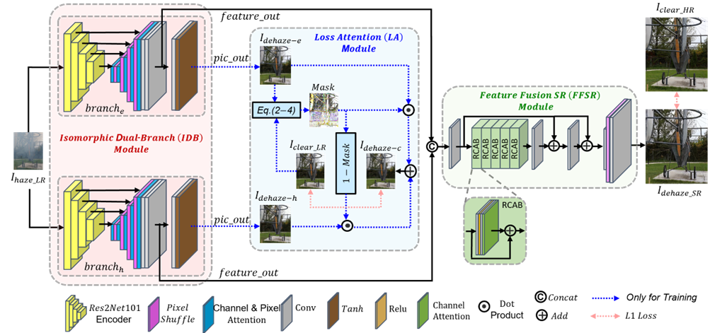
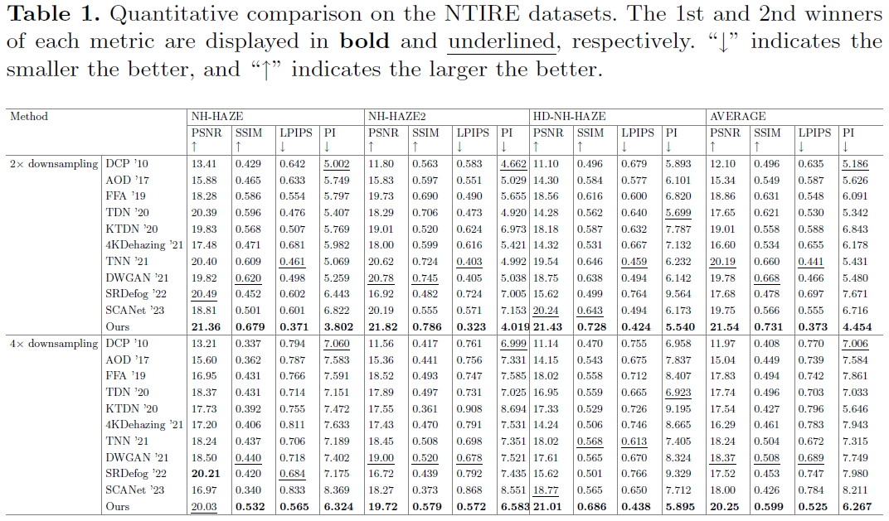
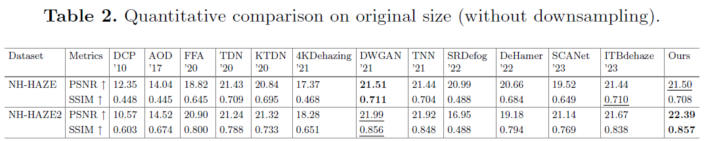
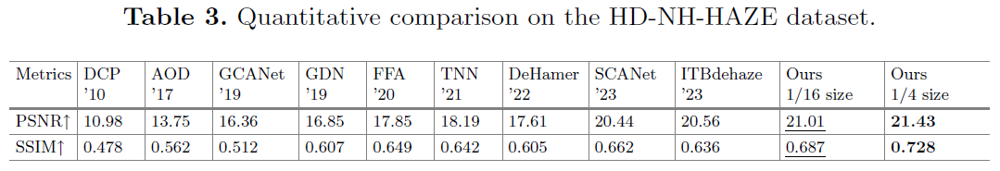

# Readme

# ****Basic Information****

1. This repository contains the official implementation of the following paper: "Isomorphic Dual-Branch Network for Non-homogeneous Image Dehazing and Super-Resolution" **Paper Link:** [https://doi.org/10.1007/978-981-99-8073-4_3](https://doi.org/10.1007/978-981-99-8073-4_3)
2. Authors: Wenqing Kuang, Zhan Li, Ruijin Guan, Weijun Yuan, Ruting Deng, and Yanquan Chen
3. Affiliation: Department of Computer Science, Jinan University, Guangzhou 510632, China
    
    ### Cite this paper
    
    <aside>
    ✅ Kuang, W., Li, Z., Guan, R., Yuan, W., Deng, R., Chen, Y. (2024). Isomorphic Dual-Branch Network for Non-homogeneous Image Dehazing and Super-Resolution. In: Luo, B., Cheng, L., Wu, ZG., Li, H., Li, C. (eds) Neural Information Processing. ICONIP 2023. Lecture Notes in Computer Science, vol 14451. Springer, Singapore. https://doi.org/10.1007/978-981-99-8073-4_3
    
    </aside>
    

# Abstract

Removing non-homogeneous haze from real-world images is a challenging task. Meanwhile, the popularity of high-definition imaging systems and compute-limited smart mobile devices has resulted in new problems, such as the high computational load caused by haze removal for large-size images, or the severe information loss caused by the degradation of both the haze and image downsampling, when applying existing dehazing methods. To address these issues, we propose an isomorphic dual-branch dehazing and super-resolution network for non-homogeneous dehazing of a downsampled hazy image, which produces dehazed and enlarged images with sharp edges and high color fidelity. We quantitatively and qualitatively compare our network with several state-of-the-art dehazing methods under the condition of different downsampling scales. Extensive experimental results demonstrate that our method achieves superior performance in terms of both the quality of output images and the computational load.

# Overview



**The architecture of our proposed methods can be separated into 3 part:**

1. **First the downsampled input feeds into two structure identically branch (called isomorphic dual-branch, IDB).**
2. **Since IDB is entirely same weight at first, we proposed a loss attention module (LA), witch help IDB learn differently during training.**
3. **When come to inference. We concatenate the feature out of IDB and feed them into a feature fusion SR module (FFSR) to directly produce HR dehazed result.**

# Environment

1. Clone Repo
    
    ```python
    git clone <code_link>
    cd IDBDehaze-main/
    
    ```
    
2. Create Conda Environment and Install Dependencies
    
    ```python
    pytorch
    CUDA
    tqdm
    piqa
    ...
    ```
    

# **Prepare pretrained models and quick test**

1. Prepare your directory structure
    
    ```python
    IDBDehaze-main
        |- dataset
            |- NH-HAZE2
                |- test
                |- haze
                |- clean
                ....
        |- model
            |- NH-HAZE-nodownsampling.pth
                |- NH-HAZE-2xdownsampling.pth
                |- NH-HAZE-4xdownsampling.pth
                ....
        |- result
        |- weights
            |- res2net101_v1b_26w_4s-0812c246.pth
    ```
    
2. Download Test Set and Models
    1. Test Set：[click here to download](https://drive.google.com/drive/folders/1ozIxhpJn5mIUI6DEv4oEXLd4ClZf28zf?usp=sharing)
    2. Models：[click here to download](https://drive.google.com/drive/folders/1niZegxvEzA5Goq74lfSjHrdBtzSGkgLB?usp=sharing)
    3. Res2Net weight：[click here to download](https://drive.google.com/drive/folders/1087h2I14YmeGZ-1eWSp-8yGgNrdoV4Yt?usp=drive_link)
3. Run eval
    
    ```python
    python3 test.py --dataset_hazy dataset/NH-HAZE2/test/haze --dataset_clean dataset/NH-HAZE2/test/gt --model_name NH-HAZE2-nodownsampling --downsample_factor 1
    ```
    
    There are four parameters that must be provided:
    
    '--dataset_hazy', help='Set the path to hazy input’
    
    '--dataset_clean', help='Set the path to clean images’
    
    '--model_name', help="Set the name to model file, model files shoud be placed in 'model' floder”
    
    '--downsample_factor', help="Set upsacle factor form ['1','0.5','0.25'],'1' means no any downsampling to input and diractly output orianl size of the input image”
    
4. The results are saved in the "result" folder.

# Result：







# Example：

## result on HD-NH-HAZE：[Download](https://drive.google.com/file/d/1uRyFic3JZxsM7XM_x3nEN68_-1DinY2S/view?usp=sharing)

1. with 2x downsampling
2. with 4x downsampling

## result on NH-HAZE2：[Download](https://drive.google.com/file/d/1KAGzTOHut_m4Mqn4krhcYvHH23JVBqHR/view?usp=sharing)

1. with 2x downsampling
2. with 4x downsampling
3. without downsampling

## result on NH-HAZE：[Download](https://drive.google.com/file/d/1SikHxueQ86e8TGRX13IWZDCEmEpgODfz/view?usp=sharing)

1. with 2x downsampling
2. with 4x downsampling
3. without downsampling
